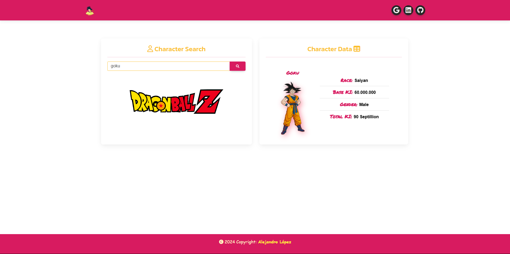

# <h1 align="center" style="color: #80cbc4;"> API Dragon Ball 👨🏻‍💻 </h1> 
  

` The Dragon Ball API ` is a comprehensive REST API inspired by the iconic television series Dragon Ball. This API grants users access to an extensive database featuring hundreds of characters, images, transformations, and planets from the Dragon Ball universe. 

    

  

## 
 Requirements 

- [HTML5](https://developer.mozilla.org/es/docs/Web/HTML) 
- [CSS3](https://developer.mozilla.org/es/docs/Web/CSS)
- [JavaScript](https://developer.mozilla.org/es/docs/Web/JavaScript)
- [BootStrap](https://mdbootstrap.com/)
- [Sweet Alert2](https://sweetalert2.github.io/)
- [Dragon Ball API](https://web.dragonball-api.com/documentation)

  

## 
 Screenshot Project 💻 

🔶 [Project Website](https://alejandro-190107.github.io/Dragon-Ball-Api/)

